<!-- ALL-CONTRIBUTORS-BADGE:START - Do not remove or modify this section -->
[](#contributors-)
<!-- ALL-CONTRIBUTORS-BADGE:END -->


# Component [Schema] 🎨

Schema UI é um projeto que fornece um 'schema' de configuração flexível e altamente personalizável para componentes customizados no VTEX IO. Utilizando React JSON Schema Form, este repositório facilita a criação de interfaces dinâmicas e adaptáveis dentro do ecossistema VTEX.

### 📌 Recursos
✅ Definição clara de types para cada propriedade <br/>
✅ Uso de widgets personalizados para melhorar a experiência de edição<br/>
✅ Implementação de dependencies e oneOf para configurações condicionais<br/>
✅ Suporte a uploads, seleções, datas, arrays e muito mais<br/>


### 🔧 Como Usar
1. Clone o repositório:
```sh
git clone https://github.com/gblcintra/schema-ui.git
cd schema-ui
```

2. Instale as dependências:

```sh
yarn install
```

3. Execute o Storybook para visualizar os componentes:
```sh
yarn storybook
```

### Schema
nomeação de componentes na interface (store\interfaces.json)

```jsx
  "schema-ui": {
    "component": "SchemaUi"
  }
```
## 🚀 Como usar no store theme

```jsx
...
{
  "store.home": {
    "title": "Home",
    "blocks": [
      "account.schema-ui:schema-ui",
      ...
    ]
  },
...
}
```

## Configuralçao

1. Adicione o aplicativo Login às dependências do seu tema no arquivo `manifest.json`:

```diff
  "dependencies": {
+   "account.schema-ui": "0.x"
  }
```

## 🛠️ Widgets Disponíveis

O `SchemaUi` suporta diferentes widgets para renderização dinâmica de campos. Alguns dos principais incluem:

| Widget                      | Tipo                      | Descrição                                                                                             |
| --------------------------- | ------------------------- | ----------------------------------------------------------------------------------------------------- |
| `ui:widget: textarea`       | `string`                  | Caixa de texto multilinhas.                                                                           |
| `ui:widget: color`          | `string`                  | Campo para seleção de cores.                                                                          |
| `ui:widget: password`       | `string`                  | Input de senha com máscara.                                                                           |
| `ui:widget: date`           | `string`                  | Campo de seleção de data.                                                                             |
| `ui:widget: datetime`       | `string`                  | Campo de seleção de data e hora.                                                                      |
| `ui:widget: range`          | `number`                  | Slider de seleção de números.                                                                         |
| `ui:widget: image-uploader` | `string`                  | Upload de imagens.                                                                                    |
| `ui:widget: select`         | `string`                  | Caixa de seleção suspensa.                                                                            |
| `ui:widget: radio`          | `string`                  | Botões de opção (radio buttons).                                                                      |
| `ui:field`                  | `({ schema }: any) => {}` | Permite a criação de componentes personalizados para exibir um campo específico.                      |
| `ui:placeholder`            | `string`                  | Define um texto de exemplo dentro do campo de entrada para orientar o usuário.                        |
| `ui:inputType`              | `string`                  | Define o tipo de entrada de um campo de texto, como password, email, tel, etc.                        |
| `ui:help`                   | `string`                  | Adiciona uma dica abaixo do campo para fornecer mais contexto ao usuário.                             |
| `ui:options`                | `object`                  | Permite configurações adicionais para widgets específicos.                                            |
| `ui:disabled`               | `boolean`                 | Desabilita um campo para impedir que ele seja editado pelo usuário.                                   |
| `ui:readonly`               | `boolean`                 | Deixa o campo somente leitura, permitindo que os usuários vejam o conteúdo, mas não façam alterações. |
| `classNames`                | `boolean`                 | Permite adicionar classes CSS personalizadas aos campos para melhor estilização.                      |

## 🛠️ Tipos Disponíveis
A configuração do schema proporciona flexibilidade através da utilização de vários tipos de dados para configurar elementos da IU. Estes tipos de dados podem ser utilizados para estilizar e definir o comportamento de diferentes componentes, quer se trate de introdução de texto, imagens, datas, cores ou menus pendentes de seleção.

| Type      | Descrição                                                                       |
| --------- | ------------------------------------------------------------------------------- |
| `String`  | Usado para campos de texto, URL, imagem ou data.                                |
| `Boolean` | Uma opção de alternância simples para ativar/desativar recursos.                |
| `Object`  | Define objetos aninhados e suas propriedades.                                   |
| `Array`   | Usado para repetir grupos de itens, como imagens, formulários ou vários campos. |


## 🎛️ Props Disponíveis

| Propriedade   | Tipo      | Descrição                                                |
| ------------- | --------- | -------------------------------------------------------- |
| `titleItem`   | `string`  | Define o título do bloco exibido.                        |
| `activeItem`  | `boolean` | Determina se o componente deve ser exibido.              |
| `textProps`   | `object`  | Propriedades relacionadas a campos de texto.             |
| `dataProps`   | `object`  | Propriedades relacionadas a seleção de datas.            |
| `selectProps` | `object`  | Propriedades relacionadas a seleções e listas suspensas. |
| `colorProps`  | `object`  | Configuração de cores para o componente.                 |
| `arrayItem`   | `array`   | Lista de itens dentro de um array.                       |

### 📌 Detalhes das Props

#### `fieldNull`
Campo Null

| Propriedade | Tipo   | Descrição                                               |
| ----------- | ------ | ------------------------------------------------------- |
| `fieldNull` | `null` | Texto de exibição, pode ser utilizado para explicações. |

```jsx
SchemaUi.schema = {
  title: 'Configuração do schema',
  type: 'object',
  properties: {
    fieldNull: {
      title: "Texto com type Null",
      type: "null",
      description: "Campos nulos como este são ótimos para adicionar informações extras",
      widget: {
        'ui:field': ({ schema }: any) => {
          return <h4 className="ma0 f5 near-black">{schema?.description}</h4>;
        },
      },
    },
  }
}
 ```
 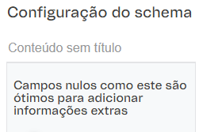

#### `textProps`
Campos de texto

| Propriedade       | Tipo     | Descrição                         |
| ----------------- | -------- | --------------------------------- |
| `titleItem`       | `string` | Texto de exibição.                |
| `passwordItem`    | `string` | Campo de senha.                   |
| `descriptionItem` | `string` | Campo de textarea para descrição. |

```jsx
SchemaUi.schema = {
  title: 'Configuração do schema',
  type: 'object',
  properties: {
    titleItem: {
      type: 'string',
      title: 'Título PlaceHolder',
      description: 'Insira o texto que será exibido no botão.',
      minLength: 10,
      widget: {
        'ui:widget': 'text',
        'ui:placeholder': 'Ex.: Teste',
      },
    },
    passwordItem: {
      type: 'string',
      title: 'Senha',
      widget: {
        'ui:inputType': 'password',
        "ui:help": "Dica: Faça com que seja forte!"
      },
    },
    descriptionItem: {
      type: "string",
      title: "Bio",
      widget: {
        "ui:widget": "textarea",
        "ui:options": {
          "rows": 5
        }
      }
    },
  }
}
 ```
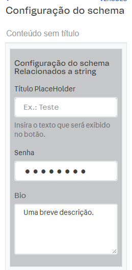

#### `dataProps`
Campos de data

| Propriedade    | Tipo     | Descrição                                  |
| -------------- | -------- | ------------------------------------------ |
| `dataItem`     | `string` | Data no formato `YYYY-MM-DD`.              |
| `dataTimeItem` | `string` | Data e hora no formato ISO 8601.           |
| `altDatetime`  | `string` | Data e hora com opções alternativas.       |
| `altDate`      | `string` | Data alternativa com formato configurável. |

```jsx
SchemaUi.schema = {
  title: 'Configuração do schema',
  type: 'object',
  properties: {
    dataItem: {
      type: 'string',
      title: 'Data',
      format: 'date',
      widget: {
        'ui:widget': 'date',
      },
    },
    dataTimeItem: {
      type: 'string',
      title: 'Data Time',
      format: 'date-time',
      widget: {
        'ui:widget': 'datetime',
      },
    },
    altDatetime: {
      type: "string",
      format: "date-time",
      widget: {
        "ui:widget": "alt-datetime",
        "ui:options": {
          "yearsRange": [
            2023,
            2030
          ],
          "format": "MDY"
        },
      },
    },
    altDate: {
      type: "string",
      format: "date",
      widget: {
        "ui:widget": "alt-date",
        "ui:options": {
          "yearsRange": [
            2023,
            2030
          ],
          "format": "MDY"
        },
      },
    },
  }
}
 ```
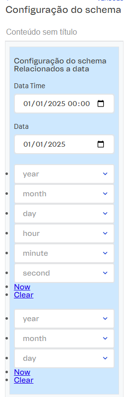

#### `selectProps`
##### Configuração dinâmica com dependências
O esquema também suporta a divisão de propriedades em grupos específicos utilizando categorias como textProps, dataProps, selectProps, colorProps e restrictProps para organizar e melhorar a interface do utilizador.

| Propriedade  | Tipo      | Descrição                                                  |
| ------------ | --------- | ---------------------------------------------------------- |
| `selectItem` | `string`  | Seleção de cor com valores predefinidos.                   |
| `colorItem`  | `string`  | Cor do título (exemplo: `#ff0000`).                        |
| `toogleItem` | `boolean` | Ativador.                                                  |
| `radioItem`  | `string`  | Seleção de opção com valores predefinidos com opção radio. |
| `reference`  | `string`  | Referência a uma definição global (`enum`).                |

```jsx
SchemaUi.schema = {
  title: 'Configuração do schema',
  type: 'object',
  definitions: {
    largeEnum: {
      enum: [
        "option #0",
        "option #1",
        "option #2",
        "option #3",
        "option #4",
        "option #5",
      ]
    },
  },
  properties: {
    selectItem: {
      title: 'Seleção de Cor',
      type: 'string',
      default: '#000',
      enumNames: ['Preto', 'Branco'],
      enum: ['#000', '#fff'],
      description: 'Por default a cor vem "Preto"',
      widget: {
        'ui:widget': 'select'
      }
    },
    colorItem: {
      title: 'Cor do titulo',
      type: 'string',
      widget: {
        'ui:widget': 'color',
      },
      default: '#666',
      description: 'Selecione a cor do texto principal do bloco',
    },
    toggleItem: {
      title: 'Ativar Item',
      type: 'boolean',
      default: true,
    },
    radioItem: {
      title: 'Escolha uma opção radio',
      type: 'string',
      enum: ['Opção 1', 'Opção 2', 'Opção 3'],
      widget: {
        'ui:widget': 'radio'
      }
    },
    reference: {
      type: 'string',
      title: 'Seleção usando definitions como referencia',
      $ref: "#/definitions/largeEnum"
    },
  }
}
 ```
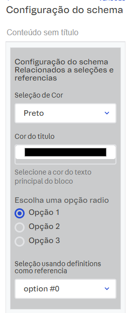

#### `restrictProps`
Restringir campos (ocultos, desativados ou só de leitura)

| Propriedade     | Tipo     | Descrição                                         |
| --------------- | -------- | ------------------------------------------------- |
| `secret`        | `string` | Texto de exibição invisível no site editor.       |
| `disabledItem`  | `string` | Texto de não editável no site editor.             |
| `readonlyItem`  | `string` | Texto de exibição somente leitura no site editor. |
| `readonlyItem2` | `string` | Texto de exibição somente leitura no site editor. |

```jsx
SchemaUi.schema = {
  title: 'Configuração do schema',
  type: 'object',
  properties: {
    secret: {
      type: "string",
      default: "Invisivel string.",
      widget: {
        "ui:widget": "hidden"
      },
    },
    disabledItem: {
      type: 'string',
      title: 'Campo Desabilitado',
      widget: {
        'ui:disabled': true,
      },
      default: 'desabilitado',
    },
    readonlyItem: {
      type: 'string',
      title: 'Campo somente Leitura',
      widget: {
        'ui:readonly': true,
      },
      default: 'somenteLeitura',
    },
    readonlyItem2: {
      type: 'string',
      title: 'Campo somente Leitura 2',
      readOnly: true,
      default: 'somenteLeitura2',
    },
  }
}
 ```
 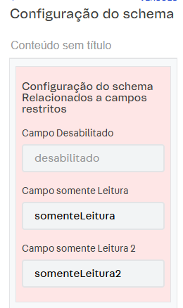


#### `arrayItem`
Campo de cadastro de itens utilizando array

| Propriedade | Tipo     | Descrição                         |
| ----------- | -------- | --------------------------------- |
| `title`     | `string` | Texto de exibição com placeholder |

```jsx
SchemaUi.schema = {
  title: 'Configuração do schema',
  type: 'object',
  properties: {
    arrayItem: {
      type: 'array',
      title: "Array de Itens",
      maxItems: 5, // máximo de itens que podem ser cadastrado em um array
      widget: {
        classNames: 'bg-washed-yellow ba b--light-gray ph3 mb3',
        'ui:options': {
          addable: true, // False ele Impede de adicionar Itens
          removable: false, // false ele Impede de apagar o item
        }
      },
      items: {
        type: 'object',
        title: "Item Array",
        widget: {
          classNames: 'bg-washed-yellow ba b--light-gray ph3 mb3'
        },
        properties: {
          __editorItemTitle: {
            title: 'Identificação do Item',
            default: 'Item',
            description: 'Max 15 caracteres',
            type: 'string',
          },
          title: {
            type: 'string',
            title: 'Titulo Teste',
            widget: {
              'ui:placeholder': 'Ex.: Teste',
            },
            description: '**Preenchimento Obrigatório**',
          },
        },
      },
    },
  }
}
 ```
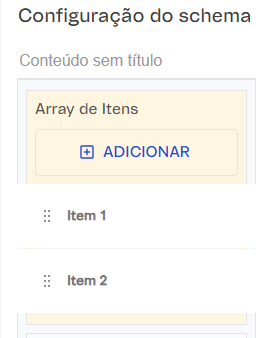
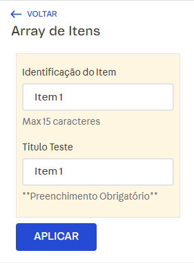

#### `uploadItem`
Campo de upload de Imagens

| Propriedade  | Tipo     | Descrição              |
| ------------ | -------- | ---------------------- |
| `uploadItem` | `string` | Carregamento de imagem |

```jsx
SchemaUi.schema = {
  title: 'Configuração do schema',
  type: 'object',
  properties: {
   uploadItem: {
      type: 'string',
      title: 'Upload de Imagem',
      widget: {
        'ui:widget': 'image-uploader',
        classNames: 'bg-white-30 ba b--light-gray ph3 mb3',
      },
    },
  }
}
 ```
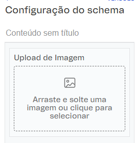

#### `uploadFile`
Campo de upload de arquivos

| Propriedade  | Tipo     | Descrição                |
| ------------ | -------- | ------------------------ |
| `uploadFile` | `string` | Carregamento de arquivos |

```jsx
SchemaUi.schema = {
  title: 'Configuração do schema',
  type: 'object',
  properties: {
    uploadFile: {
      type: 'string',
      title: 'Envie um arquivo',
      widget: {
        'ui:widget': 'file'
      }
    },
  }
}
 ```
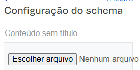

#### `showMoreConfig`
Certas configurações podem ser mostradas condicionalmente com base no estado de outros campos. Por exemplo, um campo showMoreConfig revelará campos adicionais como numberItem quando ativado.

| Propriedade         | Tipo      | Descrição                                       |
| ------------------- | --------- | ----------------------------------------------- |
| `numberItem`        | `number`  | Numero de exibição                              |
| `numberIntegerItem` | `integer` | Numero de exibição com seletor tipo barra range |

```jsx
SchemaUi.schema = {
  title: 'Configuração do schema',
  type: 'object',
  properties: {
    showMoreConfig: {
      title: 'Mostrar mais Configurações com dependencies',
      type: 'boolean',
      enum: [true, false],
      widget: {
        classNames: 'bg-black-30 ba b--light-gray ph3 mb3',
      },
    },
  },
  dependencies: {
    showMoreConfig: {
      oneOf: [
        {
          properties: {
            showMoreConfig: {
              enum: [true],
              title: 'Mostrar mais Configurações',
              type: 'boolean',
              widget: {
                classNames: 'bg-danger--faded ba b--light-gray ph3 mb3',
              }
            },
            numberItem: {
              title: 'Campo de Numero',
              type: 'number',
              default: 8,
              description: 'Esse campo é apenas para números'
            },
            numberIntegerItem: {
              title: 'Campo de Numero Inteiro Com Range',
              type: 'integer',
              default: 10,
              minimum: 10,
              maximum: 100,
              multipleOf: 10,
              widget: {
                "ui:widget": "range",
              }
            },
          },
        },
      ],
    },
  },
}
 ```
 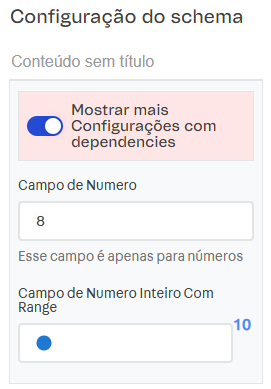

## Widgets Custons do Site Editor
### Tipagem para onChange e Registry
```jsx
  type OnChange = (val: any) => void

  type RegisteredComponent<P = any> = ComponentType<P> & {
    SchemaField?: {
      defaultProps?: {
        autoFocus?: boolean
        disabled?: boolean
        registry?: Registry
        readonly?: boolean
        uiSchema?: {
          'ui:widget'?: string
        }
        formData?: string
        name?: string
        onChange?: OnChange
      }
    }
  }
  interface Registry {
    [key: string]: RegisteredComponent
  }
```

#### `ui:widget(CUSTOM: widgetCustomUploadImage)`
O widgetCustomUploadImage é um widget customizado que encapsula o `image-uploader` padrão do Site Editor, permitindo:
- Controle total sobre a renderização
- Customização de layout
- Encapsulamento de lógica adicional
- Reutilização estruturada via `registry`
Ele utiliza o `SchemaField` interno do rjsf-team no projeto react-jsonschema-form para manter compatibilidade total com o ecossistema do schema.

---

| Propriedade               | Tipo     | Descrição                                               |
| ------------------------- | -------- | ------------------------------------------------------- |
| `widgetCustomUploadImage` | `string` | Campo de upload de imagem utilizando widget customizado |

---

### 💻 Implementação no Schema

```jsx
SchemaUi.schema = {
  title: 'Configuração do schema',
  type: 'object',
  properties: {
    widgetCustomUploadImage: {
      type: 'string',
      title: 'Widget Upload Customizado',
      widget: {
        'ui:widget': ({
          schema,
          value,
          onChange,
          registry,
        }: { schema: any, value: any, onChange: OnChange, registry: Registry }) => {

          const SchemaField = registry.fields.SchemaField as RegisteredComponent

          return (
            <div className="custom-widget">
              <SchemaField
                name="imageChoice"
                schema={{
                  type: 'string',
                  title: schema.title,
                }}
                uiSchema={{
                  'ui:widget': 'image-uploader',
                }}
                formData={value || ''}
                registry={registry}
                onChange={(url: string) => onChange(url)}
              />
            </div>
          )
        }
      },
    }
  }
}
 ```

### ⚙️ Funcionamento Técnico

1. O widget intercepta as props padrão do RJSF:
- `schema`
- `value`
- `onChange`
- `registry`
2. Recupera o `SchemaField` via `registry.fields`.
3. Renderiza internamente um campo padrão do tipo `string`.
4. Injeta o widget `image-uploader`.
5. Repassa o valor para o formulário via `onChange`.

### 🎯 Quando Utilizar

Use `widgetCustomUploadImage` quando precisar:
- Adicionar layout customizado ao upload
- Incluir validações adicionais
- Adicionar preview customizado
- Encapsular regras de negócio
- Criar múltiplos comportamentos reaproveitáveis

### 🧠 Diferença para `ui:widget: image-uploader`

| image-uploader padrão | widgetCustomUploadImage |
| --------------------- | ----------------------- |
| Uso direto            | Uso encapsulado         |
| Sem lógica adicional  | Permite lógica custom   |
| Layout padrão         | Layout customizável     |


#### `ui:widget (CUSTOM: widgetCustomText)`

O `widgetCustomText` é um widget customizado que encapsula o `text` padrão do Site Editor, permitindo:

- Controle total sobre a renderização  
- Customização de layout  
- Uso dinâmico de `description` como placeholder  
- Encapsulamento de lógica adicional  
- Reutilização estruturada via `registry`  

Ele utiliza o `SchemaField` interno do rjsf-team no projeto react-jsonschema-form para manter compatibilidade total com o ecossistema do schema.

---

| Propriedade        | Tipo     | Descrição                                    |
| ------------------ | -------- | -------------------------------------------- |
| `widgetCustomText` | `string` | Campo de texto utilizando widget customizado |

---

### 💻 Implementação no Schema

```tsx
SchemaUi.schema = {
  title: 'Configuração do schema',
  type: 'object',
  properties: {
    widgetCustomText: {
      type: 'string',
      title: 'Widget Texto Customizado',
      description: 'Esse é um exemplo de widget customizado para um campo de texto.',
      widget: {
        'ui:widget': ({
          schema,
          value,
          onChange,
          registry,
        }: { schema: any, value: any, onChange: OnChange, registry: Registry }) => {

          const SchemaField = registry.fields.SchemaField as RegisteredComponent

          return (
            <div className="custom-widget">
              <SchemaField
                name="textChoice"
                schema={{
                  type: 'string',
                  title: schema.title,
                }}
                uiSchema={{
                  'ui:widget': 'text',
                  'ui:placeholder': schema.description,
                }}
                formData={value || ''}
                registry={registry}
                onChange={(value: string) => onChange(value)}
              />
            </div>
          )
        }
      },
    }
  }
```
### ⚙️ Funcionamento Técnico

1. O widget intercepta as props padrão do RJSF:
- `schema`
- `value`
- `onChange`
- `registry`
2. Recupera o `SchemaField` via `registry.fields`.
3. Renderiza internamente um campo padrão do tipo `string`.
4. Injeta o widget `text`.
5. Define dinamicamente o `placeholder` utilizando `schema.description`.
6. Repassa o valor para o formulário via `onChange`.

### 🎯 Quando Utilizar

Use `widgetCustomText` quando precisar:
- Controlar dinamicamente o placeholder
- Adicionar layout customizado ao input
- Incluir validações adicionais
- Adicionar preview customizado
- Encapsular regras de negócio
- Criar múltiplos comportamentos reaproveitáveis

### 🧠 Diferença para `ui:widget: text`

| text padrão                   | widgetCustomText                |
| ----------------------------- | ------------------------------- |
| Uso direto                    | Uso encapsulado                 |
| Placeholder fixo via uiSchema | Placeholder dinâmico via schema |
| Sem lógica adicional          | Permite lógica custom           |
| Layout padrão                 | Layout customizável             |

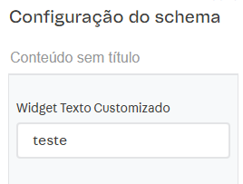


#### `ui:widget (CUSTOM: widgetCustomSelect)`

O `widgetCustomSelect` é um widget customizado que encapsula o `select` padrão do Site Editor, permitindo:

- Carregamento dinâmico de opções via API
- Cache em memória para evitar múltiplas requisições
- Controle total da renderização
- Encapsulamento de lógica assíncrona
- Reutilização estruturada via `registry`

Ele utiliza o `SchemaField` interno do rjsf-team no projeto react-jsonschema-form para manter compatibilidade total com o ecossistema do schema.

---

### 🧩 Propriedade

| Propriedade          | Tipo     | Descrição                                                |
| -------------------- | -------- | -------------------------------------------------------- |
| `widgetCustomSelect` | `string` | Campo select com opções carregadas dinamicamente via API |

---

### 💻 Implementação no Schema

```tsx
let cachedNames: string[] | null = null
let isFetching: boolean = false

SchemaUi.schema = {
  title: 'Configuração do schema',
  type: 'object',
  properties: {
    widgetCustomSelect: {
      type: 'string',
      title: 'Widget Select Customizado',
      widget: {
        'ui:widget': ({
          schema,
          value,
          onChange,
          registry
        }: { schema: any, value: any, onChange: OnChange, registry: Registry }) => {

          const SchemaField = registry.fields.SchemaField as RegisteredComponent

          if (!cachedNames && !isFetching) {
            isFetching = true

            fetch('/api/catalog_system/pub/category/tree/2')
              .then(res => res.json())
              .then((data: any[]) => {
                cachedNames = data.map(i => i.name).slice(0, 5)
                isFetching = false
                // força re-render do RJSF
                onChange(value)
              })
              .catch((err) => {
                cachedNames = []
                isFetching = false
                console.error("💚🐛  ~ Erro ao buscar opções:", err)
              })
          }

          const options =
            cachedNames === null
              ? ['Carregando...']
              : (cachedNames as string[]).length
                ? cachedNames
                : ['Sem opções']

          return (
            <div className="custom-widget">
              <SchemaField
                name="selectChoice"
                schema={{
                  type: 'string',
                  title: schema.title,
                  enum: options
                }}
                uiSchema={{
                  'ui:widget': 'select',
                }}
                formData={value || ''}
                registry={registry}
                onChange={(option: string) => onChange(option)}
              />
            </div>
          )
        },
      },
    },
  }

```

### ⚙️ Funcionamento Técnico

1. O widget intercepta as props padrão do RJSF:
- `schema`
- `value`
- `onChange`
- `registry`
2. Utiliza variáveis externas (`cachedNames` e `isFetching`) para:
- Evitar múltiplas requisições simultâneas
- Manter cache em memória
- Melhorar performance
3. Realiza requisição para:
   ```tsx
      /api/catalog_system/pub/category/tree/2
   ```
4. Mapeia os nomes retornados e limita os resultados (ex:`slice(0, 5)`).
5. Atualiza o enum dinamicamente no `SchemaField`.
6. Força re-render via `onChange` após carregamento.

---
### 🔄 Estados Possíveis

| Estado         | Resultado no Select |
| -------------- | ------------------- |
| null           | "Carregando..."     |
| Array vazio    | "Sem opções"        |
| Array populado | Lista dinâmica      |
---
### 🎯 Quando Utilizar

Use `widgetCustomSelect` quando precisar:
- Popular selects via API externa
- Trabalhar com dados dinâmicos do VTEX
- Evitar múltiplas requisições desnecessárias
- Criar comportamento inteligente com cache
- Encapsular lógica assíncrona dentro do schema

### 🧠 Diferença para `ui:widget: select`

| select padrão  | widgetCustomSelect |
| -------------- | ------------------ |
| Enum fixo      | Enum dinâmico      |
| Sem fetch      | Com fetch API      |
| Sem cache      | Cache em memória   |
| Render simples | Render inteligente |

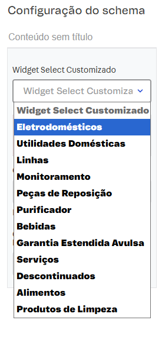

---

# `ui:widget (CUSTOM: widgetCustomRange)`

O `widgetCustomRange` encapsula um `input type="range"` dentro do Schema, permitindo:

- Controle visual em tempo real do valor selecionado  
- Experiência interativa estilo slider  
- Customização total da UI  
- Integração direta com o ciclo de vida do RJSF  

---

## 🧩 Propriedade

| Propriedade         | Tipo     | Descrição                                     |
| ------------------- | -------- | --------------------------------------------- |
| `widgetCustomRange` | `number` | Campo range customizado com slider interativo |

---

## 💻 Implementação no Schema

```tsx
widgetCustomRange: {
  type: 'number',
  title: 'Widget Range Customizado',
  widget: {
    'ui:widget': ({
      value,
      onChange,
    }: { value: any, onChange: OnChange }) => {
      return (
        <div className="custom-widget">
          <span className="db mb2">Valor: {value || 0}</span>

          <input
            type="range"
            className="w-100"
            min="0"
            max="100"
            value={value || 0}
            onChange={(e) => onChange(Number(e.target.value))}
          />

          <div className="flex justify-between">
            <span>0</span>
            <span>50</span>
            <span>100</span>
          </div>
        </div>
      )
    }
  },
}
```
---

## ⚙️ Funcionamento Técnico

1. Recebe `value` e `onChange` do RJSF.
2. Renderiza um `input type="range"` controlado.
3. Converte `string` → `number` antes de propagar.
4. Exibe o valor atual acima do slider.

---

## 🔄 Estados Possíveis

| Estado        | Resultado                     |
| ------------- | ----------------------------- |
| `undefined`   | Assume `0`                    |
| Número válido | Atualiza slider dinamicamente |

---

## 🎯 Quando Utilizar

- Ajuste de volume, porcentagem ou intensidade  
- Configurações numéricas graduais  
- UX mais intuitiva que `input number`

---

## 🧠 Diferença para `ui:widget: range` padrão

| Range padrão         | widgetCustomRange         |
| -------------------- | ------------------------- |
| Sem preview visual   | Exibe valor em tempo real |
| Estilização limitada | Total controle de UI      |
| Sem marcações        | Marcações personalizadas  |

---
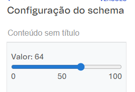
---

# `ui:widget (CUSTOM: widgetCustomRating)`

Sistema de avaliação por estrelas (1 a 5).

## 🧩 Propriedade

| Propriedade          | Tipo     | Descrição                             |
| -------------------- | -------- | ------------------------------------- |
| `widgetCustomRating` | `number` | Campo de avaliação por estrelas (1–5) |

## 💻 Implementação

```tsx
widgetCustomRating: {
  type: 'number',
  title: 'Widget Rating Customizado',
  widget: {
    'ui:widget': ({
      value,
      onChange,
    }: { value: any, onChange: OnChange }) => {
      const stars = [1, 2, 3, 4, 5]

      return (
        <div className="custom-widget">
          <div className="flex justify-center">
            {stars.map(star => (
              <span
                key={star}
                className={`f2 pointer ${value >= star ? 'gold' : 'gray'}`}
                onClick={() => onChange(star)}
              >
                ★
              </span>
            ))}
          </div>
        </div>
      )
    }
  },
}
```
---

## ⚙️ Funcionamento Técnico

1. Define um array fixo `[1–5]`.
2. Compara `value >= star` para aplicar estilo ativo.
3. Atualiza o valor ao clicar.
4. Mantém compatibilidade com tipo `number`.

---

## 🔄 Estados Possíveis

| Estado      | Resultado                        |
| ----------- | -------------------------------- |
| `undefined` | Nenhuma estrela ativa            |
| 1–5         | Estrelas preenchidas até o valor |

---

## 🎯 Quando Utilizar

- Avaliação de produto  
- Feedback interno  
- Sistema de ranking

---

## 🧠 Diferença para `ui:widget: select`

| Select padrão   | widgetCustomRating     |
| --------------- | ---------------------- |
| Lista textual   | Interface visual       |
| UX simples      | Experiência interativa |
| Menos intuitivo | Feedback imediato      |

---
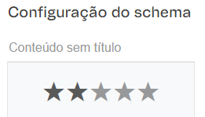
---

# `ui:widget (CUSTOM: widgetCustomColorPicker)`

Seletor visual de cores.

## 🧩 Propriedade

| Propriedade               | Tipo     | Descrição                     |
| ------------------------- | -------- | ----------------------------- |
| `widgetCustomColorPicker` | `string` | Campo seletor visual de cores |

## 💻 Implementação

```tsx
widgetCustomColorPicker: {
  type: 'string',
  title: 'Widget Color Picker Customizado',
  widget: {
    'ui:widget': ({
      value,
      onChange,
    }: { value: any, onChange: OnChange }) => {
      const colors = ['#ff0000', '#00ff00', '#0000ff', '#ffff00', '#ff00ff']

      return (
        <div className="custom-widget">
          <div className="flex justify-between">
            {colors.map(color => (
              <div
                key={color}
                className={`w2 h2 pointer mr2 ${value === color ? 'ba b--black' : ''}`}
                style={{ backgroundColor: color }}
                onClick={() => onChange(color)}
              />
            ))}
          </div>
        </div>
      )
    }
  },
}
```
---

## ⚙️ Funcionamento Técnico

1. Define array fixo de cores.
2. Aplica borda na cor selecionada.
3. Retorna valor hexadecimal (`string`).

---

## 🔄 Estados Possíveis

| Estado      | Resultado         |
| ----------- | ----------------- |
| `undefined` | Nenhuma cor ativa |
| Hex válido  | Cor marcada       |

---

## 🎯 Quando Utilizar

- Configuração de tema  
- Escolha de cor principal  
- Personalização visual

---

## 🧠 Diferença para `ui:widget: select`

| Select padrão            | widgetCustomColorPicker |
| ------------------------ | ----------------------- |
| Texto                    | Representação visual    |
| Não intuitivo para cores | Visual imediato         |
| UX básica                | UX moderna              |

---
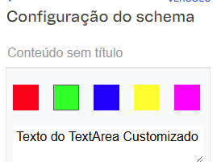
---

# `ui:widget (CUSTOM: widgetCustomTextArea)`

Campo de texto multilinha customizado.

## 🧩 Propriedade

| Propriedade            | Tipo     | Descrição                        |
| ---------------------- | -------- | -------------------------------- |
| `widgetCustomTextArea` | `string` | Campo de texto multilinha custom |

## 💻 Implementação

```tsx
widgetCustomTextArea: {
  type: 'string',
  title: 'Widget TextArea Customizado',
  widget: {
    'ui:widget': ({
      schema,
      value,
      onChange,
    }: { schema: any, value: any, onChange: OnChange }) => {
      return (
        <div className="custom-widget">
          <textarea
            className="w-100 pa2"
            placeholder={schema.description}
            value={value || ''}
            onChange={(e) => onChange(e.target.value)}
          />
        </div>
      )
    }
  },
}
```
---

## ⚙️ Funcionamento Técnico

1. Recebe `schema.description` como placeholder.
2. Controla valor via `onChange`.
3. Trabalha como campo controlado React.

---

## 🔄 Estados Possíveis

| Estado            | Resultado            |
| ----------------- | -------------------- |
| `undefined`       | Campo vazio          |
| String preenchida | Atualização dinâmica |

---

## 🎯 Quando Utilizar

- Descrições longas  
- Observações  
- Campos narrativos

---

## 🧠 Diferença para `ui:widget: textarea`

| Textarea padrão  | widgetCustomTextArea     |
| ---------------- | ------------------------ |
| Sem customização | Total controle de layout |
| Placeholder fixo | Dinâmico via schema      |

---
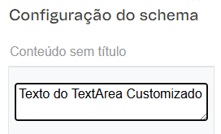
---

# `ui:widget (CUSTOM: widgetCustomCheckbox)`

Checkbox customizado.

## 🧩 Propriedade

| Propriedade            | Tipo      | Descrição                 |
| ---------------------- | --------- | ------------------------- |
| `widgetCustomCheckbox` | `boolean` | Campo boolean customizado |

## 💻 Implementação

```tsx
widgetCustomCheckbox: {
  type: 'boolean',
  title: 'Widget Checkbox Customizado',
  widget: {
    'ui:widget': ({
      schema,
      value,
      onChange,
    }: { schema: any, value: any, onChange: OnChange }) => {
      return (
        <div className="custom-widget">
          <label className="flex items-center">
            <input
              type="checkbox"
              checked={value || false}
              onChange={(e) => onChange(e.target.checked)}
            />
            <span className="ml2">{schema.title}</span>
          </label>
        </div>
      )
    }
  },
}
```
---

## ⚙️ Funcionamento Técnico

1. Trabalha com tipo `boolean`.
2. Usa `checked={value || false}`.
3. Propaga `e.target.checked`.

---

## 🔄 Estados Possíveis

| Estado  | Resultado  |
| ------- | ---------- |
| `false` | Desmarcado |
| `true`  | Marcado    |

---

## 🎯 Quando Utilizar

- Flags de ativação  
- Habilitar/desabilitar recursos  

---

## 🧠 Diferença para checkbox padrão

| Checkbox padrão           | widgetCustomCheckbox  |
| ------------------------- | --------------------- |
| Layout simples            | Layout customizado    |
| Sem controle visual extra | Integração estilizada |

---

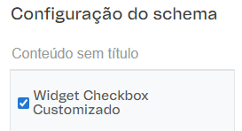
---

# `ui:widget (CUSTOM: widgetCustomRadio)`

Grupo de radio buttons customizado.

## 🧩 Propriedade

| Propriedade         | Tipo     | Descrição                        |
| ------------------- | -------- | -------------------------------- |
| `widgetCustomRadio` | `string` | Campo de seleção única via radio |

## 💻 Implementação

```tsx
widgetCustomRadio: {
  type: 'string',
  title: 'Widget Radio Customizado',
  enum: ['Opção A', 'Opção B', 'Opção C'],
  widget: {
    'ui:widget': ({
      schema,
      value,
      onChange,
    }: { schema: any, value: any, onChange: OnChange }) => {
      return (
        <div className="custom-widget">
          {schema.enum.map((option: string) => (
            <label key={option} className="flex items-center mb2">
              <input
                type="radio"
                name={schema.title}
                value={option}
                checked={value === option}
                onChange={() => onChange(option)}
              />
              <span className="ml2">{option}</span>
            </label>
          ))}
        </div>
      )
    }
  },
}
```
---

## ⚙️ Funcionamento Técnico

1. Itera sobre `schema.enum`.
2. Compara `value === option`.
3. Atualiza via `onChange(option)`.

---

## 🔄 Estados Possíveis

| Estado        | Resultado                 |
| ------------- | ------------------------- |
| `undefined`   | Nenhuma opção selecionada |
| String válida | Radio ativo               |

---

## 🎯 Quando Utilizar

- Escolhas exclusivas  
- Modos de operação  

---

## 🧠 Diferença para radio padrão

| Radio padrão         | widgetCustomRadio  |
| -------------------- | ------------------ |
| Render automático    | Controle manual    |
| Estilização limitada | Total customização |

---
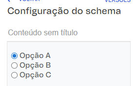
---

# `ui:widget (CUSTOM: widgetCustomMultiSelect)`

Seleção múltipla via checkboxes.

## 🧩 Propriedade

| Propriedade               | Tipo    | Descrição                        |
| ------------------------- | ------- | -------------------------------- |
| `widgetCustomMultiSelect` | `array` | Campo de seleção múltipla custom |

## 💻 Implementação

```tsx
widgetCustomMultiSelect: {
  type: 'array',
  title: 'Widget MultiSelect Customizado',
  items: {
    type: 'string',
    enum: ['Opção 1', 'Opção 2', 'Opção 3', 'Opção 4', 'Opção 5'],
  },
  widget: {
    'ui:widget': ({
      schema,
      value,
      onChange,
    }: { schema: any, value: any, onChange: OnChange }) => {
      const options = schema.items.enum || []

      return (
        <div className="custom-widget">
          {options.map((option: string) => (
            <label key={option} className="flex items-center mb2">
              <input
                type="checkbox"
                value={option}
                checked={value?.includes(option)}
                onChange={(e) => {
                  if (e.target.checked) {
                    onChange([...(value || []), option])
                  } else {
                    onChange(value.filter((v: string) => v !== option))
                  }
                }}
              />
              <span className="ml2">{option}</span>
            </label>
          ))}
        </div>
      )
    }
  },
}
```
---

## ⚙️ Funcionamento Técnico

1. Trabalha com `type: array`.
2. Adiciona/remover via spread operator.
3. Controla estado via `value?.includes`.

---

## 🔄 Estados Possíveis

| Estado         | Resultado               |
| -------------- | ----------------------- |
| `[]`           | Nenhuma opção           |
| Array populado | Múltiplas opções ativas |

---

## 🎯 Quando Utilizar

- Tags  
- Categorias múltiplas  
- Features habilitáveis simultaneamente  

---

## 🧠 Diferença para `ui:widget: select (multiple)`

| Select multiple padrão     | widgetCustomMultiSelect |
| -------------------------- | ----------------------- |
| Dropdown fechado           | Visual direto           |
| UX menos clara             | Controle explícito      |
| Difícil visualização total | Todas opções visíveis   |

---
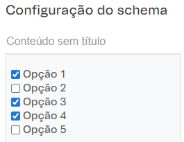
---


### Estilização campos do Site Editor usando Tachyons
#### `widget classNames `
##### Dynamic Configuration with Dependencies
Utiliza as classes do Tachyons para estilizar o bloco do site editor e deixa com a aparência mais agradável.
| Propriedade  | Tipo     | Descrição       |
| ------------ | -------- | --------------- |
| `classNames` | `string` | Classe Tachyons |

```diff
SchemaUi.schema = {
  title: 'Configuração do schema',
  type: 'object',
  properties: {
   classeItem: {
      type: 'string',
      title: 'Teste de Classe',
      widget: {
+        classNames: 'bg-white-30 ba b--light-gray ph3 mb3',
      },
    },
  }
}
 ```
 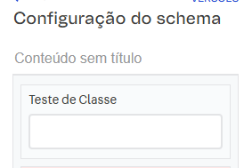

## 📌 Exemplo Completo de implementação em componentes

```tsx
<SchemaUi
  titleItem="Configuração Avançada"
  activeItem={true}
  textProps={{
    titleItem: "Texto de Exemplo",
    passwordItem: "segredo123",
    descriptionItem: "Este é um campo de textarea."
  }}
  selectProps={{
    selectItem: "#000",
    reference: "option #2"
  }}
  colorProps={{
    colorItem: "#ff0000"
  }}
  dataProps={{
    dataItem: "2025-02-21",
    dataTimeItem: "2025-02-21T15:00:00"
  }}
/>
```

📖 Documentação
Para mais detalhes sobre a estrutura do schema, consulte a [documentação oficial do rjsf](https://github.com/rjsf-team/react-jsonschema-form).

## 🤝 Contribuição
<!-- ALL-CONTRIBUTORS-LIST:START - Do not remove or modify this section -->
<!-- prettier-ignore-start -->
<!-- markdownlint-disable -->
<table>
  <tbody>
    <tr>
      <td align="center" valign="top" width="14.28%"><a href="https://br.linkedin.com/in/gblcintra"><br /><sub><b>Gabriel Cintra</b></sub></a><br /><a href="https://github.com/gblcintra/schema-ui/commits?author=gblcintra" title="Code">💻</a> <a href="https://github.com/gblcintra/schema-ui/commits?author=gblcintra" title="Documentation">📖</a> <a href="#maintenance-gblcintra" title="Maintenance">🚧</a></td>
    </tr>
  </tbody>
</table>

<!-- markdownlint-restore -->
<!-- prettier-ignore-end -->

<!-- ALL-CONTRIBUTORS-LIST:END -->

Sinta-se à vontade para contribuir com melhorias! Basta abrir uma issue ou pull request no repositório.

## Como Contribuir
1. Faça um fork do repositório.
2. Crie uma branch para a sua feature (`git checkout -b feature/MinhaFeature`).
3. Commit suas mudanças (`git commit -am 'Adiciona nova funcionalidade'`).
4. Envie a branch para o repositório remoto (`git push origin feature/MinhaFeature`).
5. Abra um Pull Request no GitHub.

Se você encontrou algum bug ou tem uma sugestão, abra uma issue ou um pull request!

