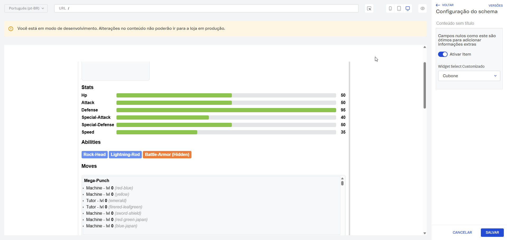

# SchemaUiPokemon

Este componente demonstra como usar um **widget customizado** no schema (`widgetCustomSelect`) para buscar Pokémons na [PokéAPI](https://pokeapi.co/) e exibir os detalhes no app.



## Contexto de renderização (VTEX Admin)

Este schema e seu widget customizado são renderizados no **Site Editor do painel Admin da VTEX**. Ou seja:

- o campo `widgetCustomSelect` aparece como configuração editável no editor;
- o valor selecionado no Admin é persistido no bloco e entregue ao componente `SchemaUiPokemon` na storefront;
- o fluxo de `loading` e preenchimento de `inFoPoke` acontece durante a interação no contexto do editor.

## Visão geral do `widgetCustomSelect`

No arquivo `schema.tsx`, o campo `widgetCustomSelect` é definido como `type: 'string'`, mas seu valor real é um objeto com o estado necessário para o fluxo do widget:

- `selected`: nome do Pokémon escolhido no select.
- `inFoPoke`: resposta detalhada do Pokémon retornada pela API.
- `loading`: estado de carregamento enquanto os dados são buscados.

Isso é possível porque o `ui:widget` customizado controla o `onChange` manualmente.

## Como o widget funciona

### 1) Carregamento inicial das opções

Quando o widget é renderizado, ele tenta buscar os **151 primeiros Pokémons**:

- Endpoint: `https://pokeapi.co/api/v2/pokemon?limit=151`
- Os nomes são armazenados em cache (`cachedNames`) para evitar novas requisições desnecessárias.
- Durante o carregamento, o select mostra `Carregando...`.

```ts
...
const typedValue = value as { selected?: string; inFoPoke?: Pokemon, loading: boolean } | undefined

const SchemaField = registry.fields.SchemaField

if (!cachedNames && !isFetching) {
  isFetching = true

  fetch('https://pokeapi.co/api/v2/pokemon?limit=151')
    .then(res => res.json())
    .then((data: { results: { name: string }[] }) => {
      cachedNames = data.results.map((i: { name: string }) => i.name)
      isFetching = false
      // força re-render do RJSF
      onChange(typedValue ? { ...typedValue, selected: typedValue.selected, loading: false } : { selected: '', loading: false })
    })
    .catch((err) => {
      cachedNames = []
      isFetching = false
      console.error("💚🐛 ~ Erro ao buscar opções:", err)
      onChange(typedValue ? { ...typedValue, selected: typedValue.selected, loading: false } : { selected: '', loading: false })
    })
}
...
```

### 2) Renderização do select

O widget usa `registry.fields.SchemaField` para reaproveitar o campo padrão do RJSF com:

- `schema.enum` contendo os nomes dos Pokémons capitalizados.
- `ui:widget: 'select'` para manter a UX nativa do select.

### 3) Seleção de um Pokémon

Ao selecionar um item:

1. O widget atualiza o estado com `loading: true`.
2. Calcula o ID do Pokémon com base na posição no array de opções.
3. Busca os detalhes em `https://pokeapi.co/api/v2/pokemon/{id}`.
4. Atualiza `onChange` com:
   - `selected`
   - `inFoPoke` (dados completos)
   - `loading: false`

Se houver erro, o widget finaliza com `inFoPoke: null` e `loading: false`.

```tsx
...
const handleChange = (selected: string) => {
    onChange({
      selected,
      inFoPoke: null,
      loading: true
    })

    const index = options.indexOf(selected)

    if (index === -1) return

    const pokemonId = index + 1

    fetch(`https://pokeapi.co/api/v2/pokemon/${pokemonId}`)
      .then(res => res.json())
      .then((data) => {
        onChange({
          selected: selected,
          inFoPoke: data,
          loading: false
        })
      })
      .catch((err) => {
        console.error("Erro ao buscar pokemon:", err)
        onChange({
          selected: selected,
          inFoPoke: null,
          loading: false
        })
      })
  }
  
  return (
    <div className="custom-widget">
      <SchemaField
        name="selectChoice"
        schema={{
          type: 'string',
          title: schema.title,
          enum: options
        }}
        uiSchema={{
          'ui:widget': 'select',
        }}
        formData={typedValue?.selected || ''}
        registry={registry}
        onChange={(option) => handleChange(option as string)}
      />
    </div>
  )
  ...
```

## Integração com o componente `SchemaUiPokemon`

No `index.tsx`, o componente consome diretamente o valor do `widgetCustomSelect`:

- Se `loading` for `true`: mostra estado de carregamento.
- Se `inFoPoke` for `null/undefined`: mostra mensagem de item não selecionado.
- Se houver dados: renderiza card completo com sprite, tipos, stats, habilidades, golpes e sprites por versão.

## Estrutura esperada do valor no schema

Exemplo do payload salvo em `widgetCustomSelect`:

```json
{
  "selected": "Bulbasaur",
  "inFoPoke": { "id": 1, "name": "bulbasaur" },
  "loading": false
}
```

Diagrama:

┌─────────────────────────────────────────────┐
│ 1) VTEX Admin (Site Editor)                 │
│ - Usuário abre o bloco                      │
│ - Campo custom aparece                      │
└───────────────┬─────────────────────────────┘
                │ renderiza campo
                ▼
┌─────────────────────────────────────────────┐
│ 2) Widget Custom (widgetCustomSelect)       │
│ - Carrega opções (Pokémons)                 │
│ - Exibe loading                             │
│ - Usuário seleciona item                    │
│ - Dispara onChange                          │
└───────────────┬─────────────────────────────┘
                │ fetch opções/detalhes
                ▼
┌─────────────────────────────────────────────┐
│ 3) API Externa (PokéAPI)                    │
│ GET /pokemon?limit=151  -> lista nomes      │
│ GET /pokemon/{id}       -> detalhes item    │
└───────────────┬─────────────────────────────┘
                │ resposta JSON
                ▼
┌─────────────────────────────────────────────┐
│ 4) Persistência no Schema do bloco          │
│ valor salvo em widgetCustomSelect:          │
│ {                                           │
│   selected: "Bulbasaur",                    │
│   inFoPoke: {...dados...},                  │
│   loading: false                            │
│ }                                           │
└───────────────┬─────────────────────────────┘
                │ props do bloco
                ▼
┌─────────────────────────────────────────────┐
│ 5) Storefront (SchemaUiPokemon)             │
│ - Lê selected/inFoPoke/loading              │
│ - Renderiza loading OU conteúdo dinâmico    │
│   (sprite, tipos, stats, etc.)              │
└─────────────────────────────────────────────┘

## Observações

- O cache em memória (`cachedNames`) vive enquanto o módulo está carregado.
- O widget usa fetch nativo e não depende de cliente HTTP externo.
- A capitalização visual dos nomes é feita com utilitário local (`capitalize`).
